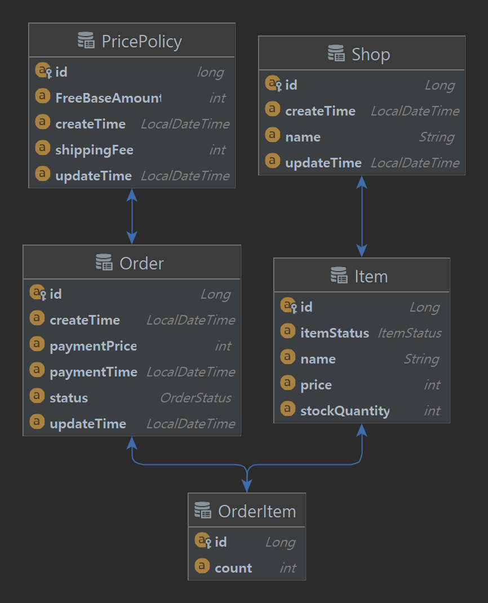

# 주문처리API

상점 등록 및 상품 등록 후 주문 처리를 하는 rest api 예제

### 기능

- 상점 목록조회
- 상점 상품목록 조회
- 상점 생성
- 상품 생성
- 상품 목록조회
- 상품 단일조회
- 주문 생성
- 주문 목록조회
- 주문 단일조회
- 주문 수정
- 주문 취소
- 주문 결제

### 구조

```
└── src
    └── main
	├── java\com\shop\sample
        │   ├── SampleApplication.java
	│   ├── api
	│   │   ├── ItemApi.java
	│   │   ├── OrderApi.java
	│   │   ├── PaymentApi.java
	│   │   └── ShopApi.java
	│   ├── application
	│   │   ├── ItemService.java
	│   │   ├── OrderService.java
	│   │   ├── PaymentService.java
        │   │   ├── PricePolicyService.java
	│   │   └── ShopService.java
	│   ├── dao
	│   │   ├── ItemRepository.java
	│   │   ├── OrderItemRepository.java
	│   │   ├── OrderRepository.java
        │   │   ├── PricePolicyRepository.java
	│   │   └── ShopRepository.java
	│   ├── domain
	│   │   ├── Item.java
	│   │   ├── ItemStatus.java
	│   │   ├── Order.java
	│   │   ├── OrderItem.java
	│   │   ├── OrderStatus.java
        │   │   ├── PricePolicy.java
	│   │   └── Shop.java
	│   ├── dto
	│   │   ├── ItemDTO.java
	│   │   ├── OrderDTO.java
	│   │   ├── OrderItemDTO.java
	│   │   └── ShopDTO.java
	│   ├── exception
	│   │   ├── NotEnoughPriceException.java
	│   │   ├── NotFoundDataException.java
        │   │   ├── PaymentCompleteException.java
	│   │   ├── RestAdviceException.java
        │   │   └── SoldOutException.java
	│   ├── global
	│   │   └── DBNaming.java
	│   └── model
	│       ├── APIMessage.java
	│       └── Status.java
	└── resources
	    └── application.yml
```

### ER Diagram


### API DOC
https://documenter.getpostman.com/view/20485363/UzBnrSYt#intro
